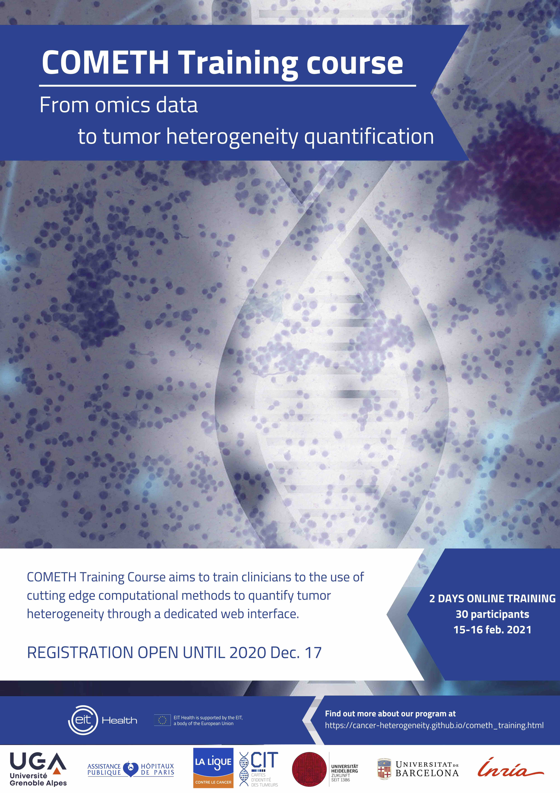
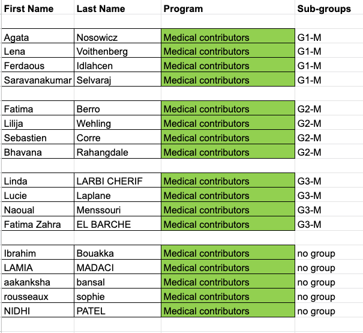
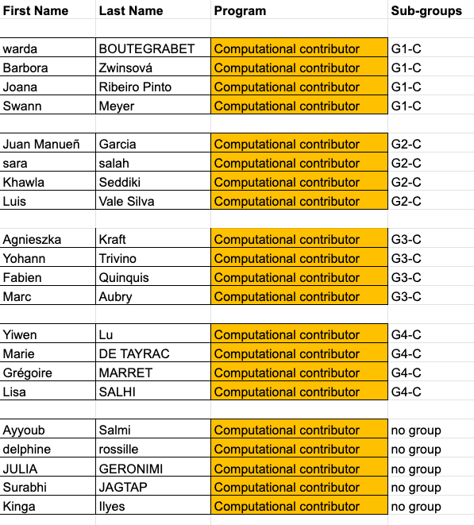
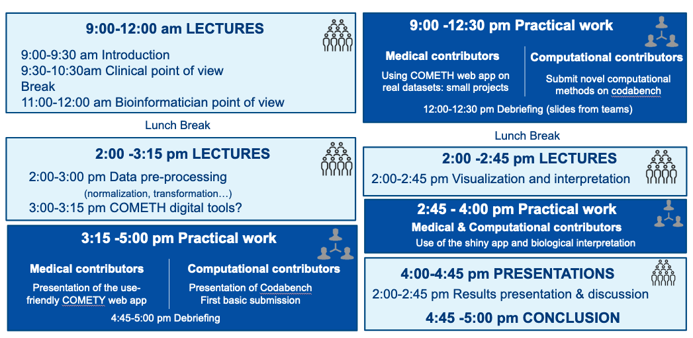
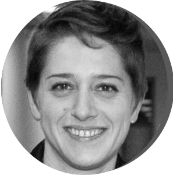

<br>

***
## COMETH training course : objectives

 &nbsp;  <font size="5"><span style="color: darkblue;">15-16 Feb.2021, ONLINE</span></font>
 
<font size="4">This 2-day online course aims to train clinicians to the use of cutting edge computational methods to quantify tumor heterogeneity through a dedicated user-friendly web interface.</font>
&nbsp; 
  

<form action="https://comteh-winter21.sciencesconf.org/">
<input type="submit" id="search" value="🎓 Register now"  style="height:50px; width:150px" />
</form>

<font size="4"><span style="color: red;">Registration deadline extension: 10 January 2021</span></font>  

&nbsp; 

{width=40%}
<br>

***

## Digital platforms

### Zoom plenary sessions

For all participants:

- Please register to DAY1 [zoom session](https://univ-grenoble-alpes-fr.zoom.us/meeting/register/tJAscOyvrzktH9Mh_qA1UI-EHGZN7mxu1rZa)
- Please register to DAY2 [zoom session](https://univ-grenoble-alpes-fr.zoom.us/meeting/register/tJIkduiopzsjGtG_ovpiua3R6MCZbiGFXKyG)


### Discord discussion platform

For all participants:

- Create an account on discord
- Download discord application (highly recommanded to ease the exchanges between participants)
- Join the COMETH training [forum](https://discord.gg/ZPxszeQxnT) 

### Codabench

For computational participants:

- Go to the application : [Codabench platform for data challenges](https://www.codabench.org/competitions/237/?secret_key=b164d1c1-07ca-4d0c-b55f-99e68af3a343)
- create an account on the platform
- register to the *COMETH deconvolution data challenge*
- [Tutorial](cometh_training_2021/cometh_training_codabench.html) on the use of the codabench platform

### COMETH web application

For clinician participants:

- Go to the application: [COMETH user-friendly web application](https://staging-cometh.meteorlab.st/login)
- create an account on the platform
- [Tutorial](cometh_training_2021/cometh_training_webapp.html) on the use of the cometh web application

### COMETH  Docker image deconExplorer

For those who want to run the deconvolution and interpretation app locally, we provide a **docker image** allowing  to run  all steps of the analysis locally, through your web browser. We provide the instructions for uses running a macOS or linux operating system!

1. download and install the [docker Dektop software](https://www.docker.com/products/docker-desktop) for your OS
2. open a terminal and type the following commands:

```{r eval=FALSE}
cd ~
docker pull ashwinikrsharma/mrna_meth_decon:latest
git clone https://github.com/ashwini-kr-sharma/ShinyCompExplore.git
docker run --rm -it -p 3838:3838 -v ~/ShinyCompExplore:/srv/shiny-server/ ashwinikrsharma/mrna_meth_decon
```

3. open a web browser, and type `localhost:3838` in the address bar

Good to go!

### COMETH shiny application

- [Shiny app comExplorer](https://app.gebican.fr/compExplore/)
- **TO UPDATE**

<br>

***

## Material to download 

Practical work will differ according to your affectation (medical or bioinformatic group). Please check your affectation and download the corresponding material [here](https://docs.google.com/spreadsheets/d/1-pV-wSTH1P8VDZDdmm-cgZ5FmqY_2t5JoSuKQW7g7aE/edit?usp=sharing).




### For medical group

#### Datasets

We have prepared toy expression datasets from the TCGA public cancer database (including clinical annotation tables). 

!!Format!!  .cvs with separator = ";" and decimal = "." Samples in column, genes in row (use Gene Symbol as gene ID). If you want to use your own dataset during the course, please use the same csv format (separator = ";" and decimal = ".").

Omic type : transcriptome (fpkm from RNA-seq, linear scale)
- [Breast cancer - brca](data/brca.zip)
- [Glioblastome - gbm](data/gbm.zip)
- [Lund adenocarcinoma - luad](data/luad.zip)
- [Pancreatic adenocarcinoma - paad](data/paad.zip)
- [Skin cutaneous melanoma - skcm](data/sskcm.zip)

#### Practical work sheet

[Link to the 'Practical work sheet'](https://docs.google.com/document/d/1Wbe1qxUJd62ei8zc6reP_ljKVAhK7XQgJQpxH_nnY60/edit?usp=sharing)

### For bioinformatic group

The following R packages migth be of interest

- [Edec](https://github.com/BRL-BCM/EDec)
- [Cellmix](http://web.cbio.uct.ac.za/~renaud/CRAN/web/CellMix/)
- [NMF](https://cran.r-project.org/web/packages/NMF/index.html)
- [ICA](https://cran.r-project.org/web/packages/fastICA/index.html)
- [Timer](http://cistrome.org/TIMER/)


<br>

***
## Presentation supports

### DAY1

### DAY2

<br>

***
## Course format and program

<font size="4"> 2-day online sessions with general lectures and practical training. </font> 

General lectures will cover:  

&nbsp; • Introduction to cancer heterogeneity 

&nbsp; • Introduction to computational methods  

&nbsp; • Interpretation and visualization of the results   




<br> 

***
## Target Group

- Cancer pathologists

- Research scientists

- Clinicians


<font size="4"><span style="color: red;">Limited to 30 participants.</span></font>

<br>

***

## Registration
 

 
Registration is free of charge but mandatory. 

Deadline: 10 January 2021

<form action="https://comteh-winter21.sciencesconf.org/">
<input type="submit" value="🎓Register now" />
</form>


***

## Trainers 


<div class = "row">
  
<div class = "col-md-4">
<br><br>
<center>
{width=50%}

**Yuna Blum**    
Research scientist,   
Ligue Contre le Cancer
Paris, France  
[Read more](cometh_training_yb.html) 
</center>
</div>
  
<div class = "col-md-4">
<br><br>
<center>
{width=50%}

**Jérôme Cros**    
Clinician  
APHP, Paris, France  
[Read more](cometh_training_jc.html) 

</center>
</div>
  
<div class = "col-md-4">
<br><br>
<center>
{width=50%}

**Carl Herrmann**    
Assistant-professor,   
Medical Faculty Heidelberg, Germany   
[Read more](cometh_training_ch.html) 

</center>


</div>
</div>


<div class = "row">
  
<div class = "col-md-4">
<br><br>
<center>
{width=50%}

**Slim Karkar**    
Research scientist,  
Uni. Grenoble Alpes, France  
[Read more](cometh_training_sk.html) 
</center>
</div>
  
<div class = "col-md-4">
<br><br>
<center>
{width=50%}


**Magali Richard**   
Research scientist,   
Uni. Grenoble Alpes, France  
 [Read more](cometh_training_mr.html) 

</center>
</div>
  
<div class = "col-md-4">
<br><br>
<center>
{width=50%}

**Ashwini Sharma**   
Research scientist,  
Medical Faculty Heidelberg, Germany  
 [Read more](cometh_training_as.html) 

</center>


</div>
</div>

<br>

<font size="4"> **Technical support** </font> 

**Clémentine Decamps**, Phd Student, Uni. Grenoble Alpes, France   
**Yasmina Kermezli**, Postdoctoral fellow, Uni. Grenoble Alpes, France

<br>


