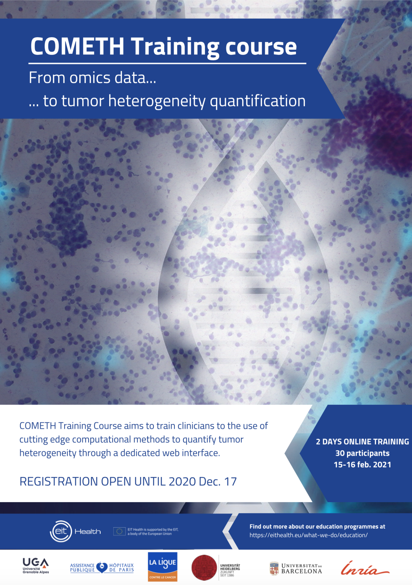

 

***
## Winter course   &nbsp;  15-16 Feb.2021, ONLINE  

 
This 2-day online course aims to train clinicians to the use of cutting edge computational methods to quantify tumor heterogeneity through a dedicated user-friendly web interface.
&nbsp; 
  

<form action="https://www.sciencesconf.org/">
<input type="submit" id="search" value="🎓 Register now"  style="height:50px; width:150px" />
</form>

  
&nbsp; 

{width=40%}

***

## Course Format

 2-day online sessions with general lectures and practical training.  

General lectures will cover:  

&nbsp; • Introduction to cancer heterogeneity 

&nbsp; • Introduction to computational methods  

&nbsp; • Interpretation and visualization of the results   

DETAILED PROGRAM HERE

  

***
## Target Group

&nbsp; • Clinicians 

&nbsp; • Anatomopathologist  

&nbsp; • Bioinformaticians 

Limited to 30 participants.

 

***

## Registration
 
Registration deadline: 17 dec.2020  

 
Registration fees:  

<form action="https://www.sciencesconf.org/">
<input type="submit" value="🎓Register now" />
</form>

***

## Teachers 

  

  

{width=50%}

**Carl Hermann**,  
Assistant-professor, Medical Faculty University Heidelberg   
[Read more](https://getbootstrap.com/docs/4.0/layout/grid/) 

  

  

{width=50%}

**Ashwini Sharma**,  
Research scientist
Medical Faculty University Heidelberg, Germany  
 [Read more](https://getbootstrap.com/docs/4.0/layout/grid/) 

  

  

{width=50%}

**Magali Richard**,  
Research scientist,   
Uni. Grenoble Alpes, France  
 [Read more](https://getbootstrap.com/docs/4.0/layout/grid/) 

