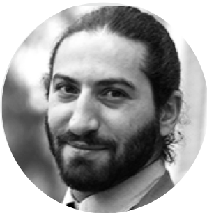

 

***
## Winter course   &nbsp;  15-16 Feb.2021, ONLINE  

 
This 2-day online course aims to train clinicians to the use of cutting edge computational methods to quantify tumor heterogeneity through a dedicated user-friendly web interface.
&nbsp; 
  

<form action="https://comteh-winter21.sciencesconf.org/">
<input type="submit" id="search" value="🎓 Register now"  style="height:50px; width:150px" />
</form>

  
&nbsp; 

{width=40%}

***

## Course Format

 2-day online sessions with general lectures and practical training.  

General lectures will cover:  

&nbsp; • Introduction to cancer heterogeneity 

&nbsp; • Introduction to computational methods  

&nbsp; • Interpretation and visualization of the results   

[DOWNLOAD THE PROGRAM](pictures/COMETH_program.pdf)

  

***
## Target Group

&nbsp; • Clinicians 

&nbsp; • ACancer pathologists 

&nbsp; • BReserch scientist 

Limited to 30 participants.

 

***

## Registration
 
Registration deadline: 17 dec.2020  

 
Registration fees:  

<form action="https://comteh-winter21.sciencesconf.org/">
<input type="submit" value="🎓Register now" />
</form>

***

## Trainers 

  

  

{width=50%}

**Yuna Blum**    
Research scientist,   
Ligue Contre le Cancer
Paris, France  
[Read more](cometh_training_yb.html) 

  

  

{width=50%}

**Jérôme Cros**    
Clinician  
APHP, Paris, France  
[Read more](cometh_training_jc.html) 

  

  

{width=50%}

**Carl Herrmann**    
Assistant-professor,   
Medical Faculty Heidelberg, Germany   
[Read more](cometh_training_ch.html) 

  

  

{width=50%}

**Slim Karkar**    
Research scientist,  
Uni. Grenoble Alpes, France  
[Read more](cometh_training_sk.html) 

  

  

{width=50%}

**Magali Richard**   
Research scientist,   
Uni. Grenoble Alpes, France  
 [Read more](cometh_training_mr.html) 

  

  

{width=50%}

**Ashwini Sharma**   
Research scientist,  
Medical Faculty Heidelberg, Germany  
 [Read more](cometh_training_as.html) 

 

 **Technical support**  

**Clémentine Decamps**, Phd Student, Uni. Grenoble Alpes, France   
**Yasmina Kermezli**, Postdoctoral fellow, Uni. Grenoble Alpes, France

 

