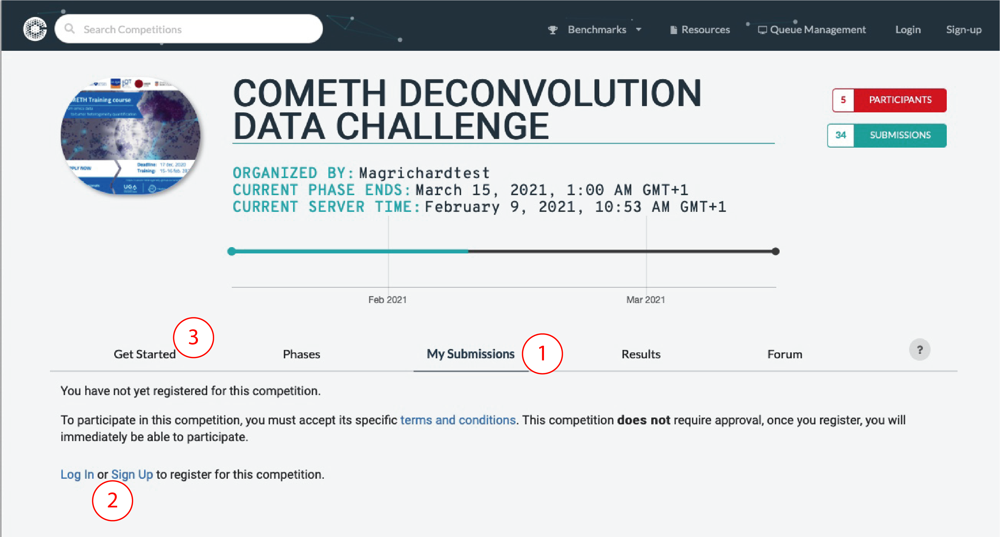
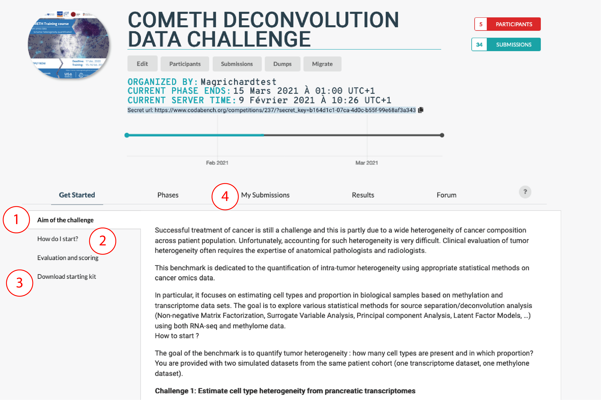
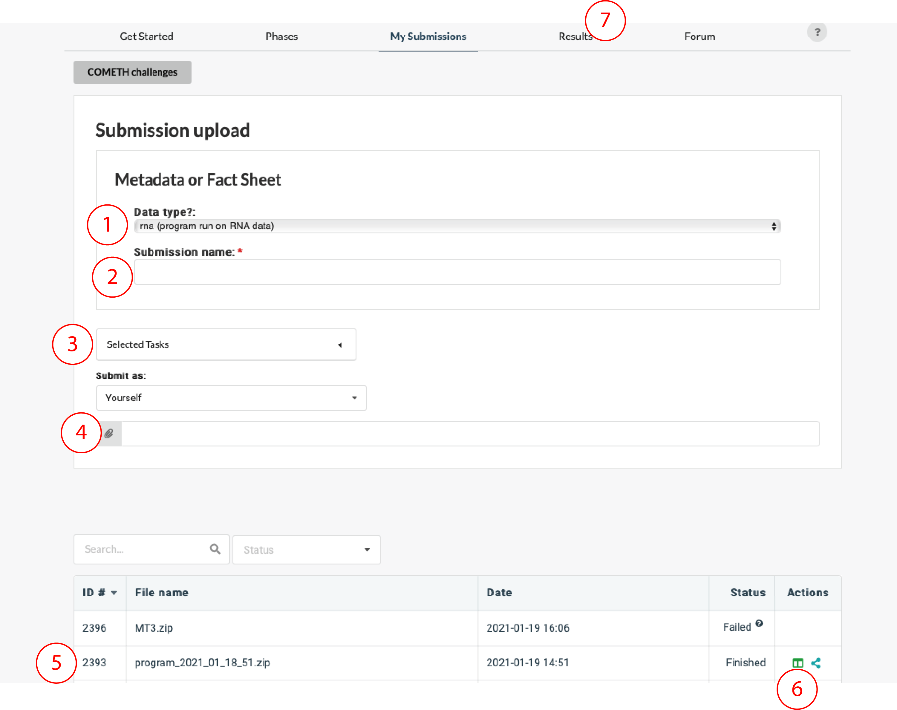

## General view

- 1: Go to the tab `my submission`
- 2: Register to the challenge
- 3: Go to the tab `get started`

## Get started

- 1: Read the `Aim of the challenge`
- 2: Read the `How to I start`
- 3: Download the `starting kit` and follow the instruction to generate a .zip submission file
- 4: Go to the tab `My submissions`

## Submissions

- 1: Enter submission information (do you submit results or code? against which task?)
- 2: Enter submission name
- 3: Select a task (i.e. transcriptome or methylome data)
- 4: Upload your .zip submission file
- 5: Check your submission status (you can click on your submission to retrieve submission log files)
- 6: Add your score on the leaderboard
- 7: Check the leaderboard

