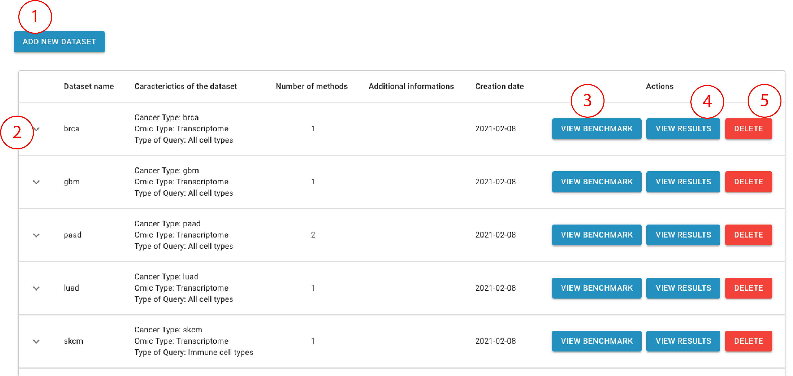
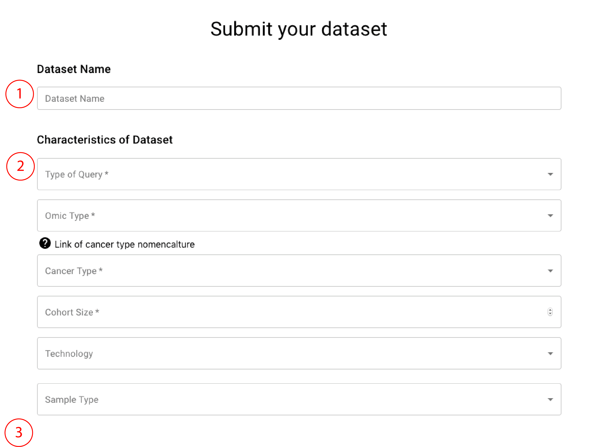
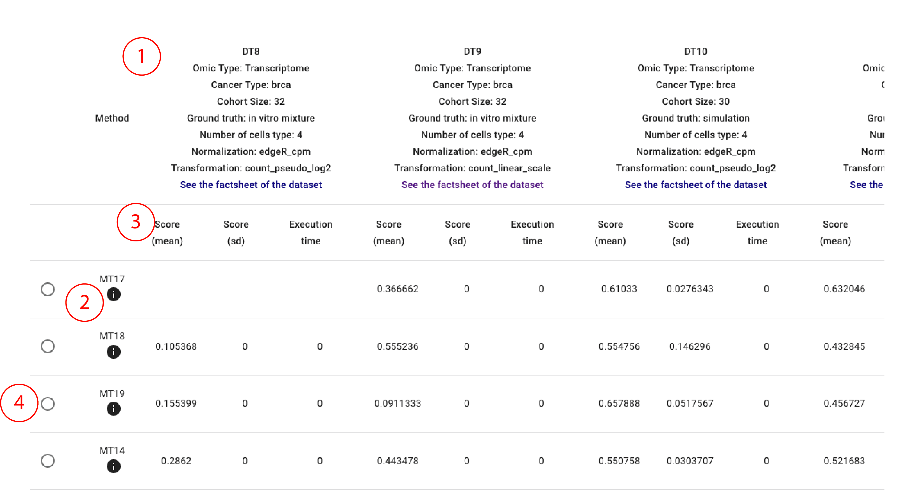
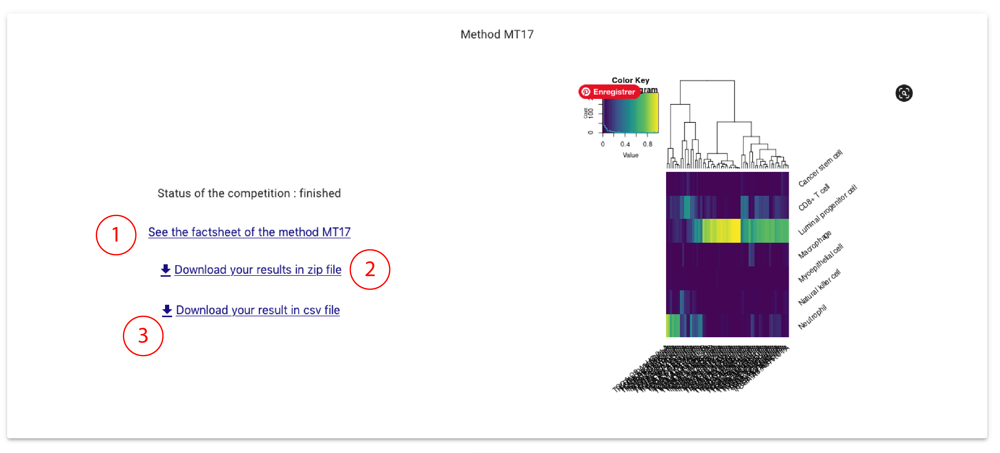
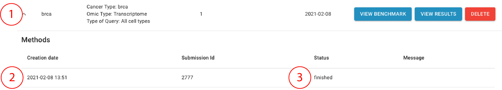

## General view

- 1: Add a new dataset
- 2: For a given dataset: details on method run on the dataset (run status, run id...)
- 3: For a given dataset: View leaderboard of computational methods apply on similar datasets
- 4: For a given dataset: View the results of the methods applied on the dataset
- 5: For a given dataset: Delete the dataset

## Submit a dataset

- 1: Name your dataset
- 2: Specify your type of query: do you want to quantify all cell type or only immune cell types?
- 3: Give information of your dataset and upload it

## View the leaderboard and run method on your dataset

- 1: In columns: benchmark dataset similar to your clinical dataset according to the descriptors you entered while submitting your dataset. You can retreive more detailed information on each datase by clicking on the html link
- 2: Computational methods (MT) that have been applied to quantify heterogeneity of these benchmark dataset on codabench. You can retreive more detailed information on each datase by clicking on the "i" button (including the R code of the algorithm)
- 3: Accurary score (mean, standart deviation and computation time) given by the codabench platform. You can sort the scores by clicking on the column names
- 4: You can choose which method you want to run on your dataset by clicking on this button

## View results

- 1: Get more information on the method
- 2: Download all results, including algorithm code, estimated proportion matrix and estimated cell-type specific profiles. In this folder, you have the following files:
  - the estimated proportion matrix in .csv and .rds format : `results_1.rds` and `results_A_1.csv`
  - the estimated reference profiles matrix in .csv and .rds format : `ref_1.rds` and `results_T_1.csv`
  - the input dataset in .rds format and associated metadata : `test_data.rds` (the clinician dataset), `cancer_type.rds` (the cancer type according to the TCGA nomenclature), `input_k_value.rds` (the number of cell type to consider when running unsupervised methods, this file in empty when running semi-supervised or supervised methods)
  - some log and metadata files generated by the codabench platform (not of use for results interpretation): `metadata`, `output_program.txt`, `Rprof.out`, `Rprof.rds`

- 3: Dowload only the estimated proportions in a .csv format (only the `results_A_1.csv` file)

## Check status of methods run

- 1: Click on the arrow to view the Methoods run agains the dataset
- 2: Date of the run
- 3: Status of the run

## Dataset contained in the benchmark

DT1: Pancreatic adenocarcinoma

  - omic type: transcriptome RNAseq (pseudo-log)
  - cohort size : 30
  - Ground Truth : in silico simulations of all cell types
  - More informations at [dataset_factsheet_DT1.html](../meteor_files/dataset_factsheet_DT1.html)
  
DT2: Pancreatic adenocarcinoma

  - omic type: transcriptome RNAseq (linear scale)
  - cohort size : 30
  - Ground Truth : in silico simulations  of all cell types
  - More informations at [dataset_factsheet_DT2.html](../meteor_files/dataset_factsheet_DT2.html)

DT4: Colorectal adenocarcinoma

  - omic type: transcriptome RNAseq (pseudolog)
  - cohort size : 12
  - Ground Truth : in silico simulations of different immune composition
  - More informations at [dataset_factsheet_DT4.html](../meteor_files/dataset_factsheet_DT4.html)
  
  
DT5: Colorectal adenocarcinoma

  - omic type: transcriptome RNAseq (linear scale)
  - cohort size : 12
  - Ground Truth : in silico simulations of different immune composition
  - More informations at [dataset_factsheet_DT5.html](../meteor_files/dataset_factsheet_DT5.html)
  
  
DT8: Breast invasive cancer

  - omic type: transcriptome RNAseq (pseudolog)
  - cohort size : 32
  - Ground Truth : in vitro mixture of different cell types
  - More informations at [dataset_factsheet_DT8.html](../meteor_files/dataset_factsheet_DT8.html)
  
  
DT9: Breast invasive cancer

  - omic type: transcriptome RNAseq (linear scale)
  - cohort size : 32
  - Ground Truth : in vitro mixture of different cell types
  - More informations at [dataset_factsheet_DT9.html](../meteor_files/dataset_factsheet_DT9.html)
  

DT10: Breast invasive cancer

  - omic type: transcriptome RNAseq (pseudolog)
  - cohort size : 30
  - Ground Truth :  in silico simulations  of all cell types
  - More informations at [dataset_factsheet_DT10.html](../meteor_files/dataset_factsheet_DT10.html)
  
  
DT11: Breast invasive cancer

  - omic type: transcriptome RNAseq (linear scale)
  - cohort size : 30
  - Ground Truth :  in silico simulations  of all cell types
  - More informations at [dataset_factsheet_DT11.html](../meteor_files/dataset_factsheet_DT11.html)
  
  
DT12: Breast invasive cancer
 
  - omic type: methylome targeted bisulfite sequencing (beta_value)
  - cohort size : 30
  - Ground Truth :  in silico simulations  of all cell types
  - More informations at [dataset_factsheet_DT12.html](../meteor_files/dataset_factsheet_DT12.html)

## Methods contained in the benchmark

### Unsupervised

Unsupervised methods do not use biological references.

MT1_ICA_fs: ICA with ICA-based feature selection

  - Type of query: estimation of all cell types or immune cell types
  - omic type: trasncriptome
  - More informations at [algorithm_factsheet_MT1.html](../meteor_files/algorithm_factsheet_MT1.html)
  - Get the R code here: [algorithm_MT1.R](meteor_files/algorithm_MT1.R)

MT2_NMF_fs: NMF with ICA-based feature selection

  - Type of query: estimation of all cell types or immune cell types
  - omic type: trasncriptome
  - More informations at [algorithm_factsheet_MT2.html](../meteor_files/algorithm_factsheet_MT2.html)
  - Get the R code here: [algorithm_MT2.R](meteor_files/algorithm_MT2.R)
  
MT3_edec: Edec method

  - Type of query: estimation of all cell types or immune cell types
  - omic type: methylome
  - More informations at [algorithm_factsheet_MT3.html](../meteor_files/algorithm_factsheet_MT3.html)
  - Get the R code here: [algorithm_MT3.R](meteor_files/algorithm_MT3.R)
  
MT14_ICA: ICA without feature selection

  - Type of query: estimation of all cell types or immune cell types
  - omic type: transcriptome and methylome
  - More informations at [algorithm_factsheet_MT14.html](../meteor_files/algorithm_factsheet_MT14.html)
  - Get the R code here: [algorithm_MT14.R](meteor_files/algorithm_MT14.R)
  
MT19_NMF: NMF without feature selection

  - Type of query: estimation of all cell types or immune cell types
  - omic type: transcriptome and methylome
  - More informations at [algorithm_factsheet_MT19.html](../meteor_files/algorithm_factsheet_MT19.html)
  - Get the R code here: [algorithm_MT19.R](meteor_files/algorithm_MT19.R)

### Semi-supervised

Semi-supervised methods use a gene marker list as input of the deconvolution.
  
MT16_cellmix_ssKL: CellMix semi-supervised NMF using KL divergence

  - Type of query: estimation of all cell types or immune cell types
  - omic type: transcriptome
  - More informations at [algorithm_factsheet_MT16.html](../meteor_files/algorithm_factsheet_MT16.html)
  - Get the R code here: [algorithm_MT16.R](meteor_files/algorithm_MT16.R)
  
MT17_cellmix_DSA: CellMix digital sorting algorithm

  - Type of query: estimation of all cell types or immune cell types
  - omic type: transcriptome
  - More informations at [algorithm_factsheet_MT17.html](../meteor_files/algorithm_factsheet_MT17.html)
  - Get the R code here: [algorithm_MT17.R](meteor_files/algorithm_MT17.R)
  
MT18_cellmix_ssFrobenius: CellMix semi-supervised NMF using eucideann distance

  - Type of query: estimation of all cell types or immune cell types
  - omic type: transcriptome
  - More informations at [algorithm_factsheet_MT18.html](../meteor_files/algorithm_factsheet_MT18.html)
  - Get the R code here: [algorithm_MT18.R](meteor_files/algorithm_MT18.R)
  
### Supervised

Supervised method use a cell-type specific expression matrix as input of the deconvolution.

MT16_cibersort: Cibersort method

  - Type of query: estimation of immune cell types
  - omic type: transcriptome
  - More informations at [algorithm_factsheet_MT8.html](../meteor_files/algorithm_factsheet_MT8.html)
  - Get the R code here: [algorithm_MT8.R](meteor_files/algorithm_MT8.R)
  
MT9_epic: EPIC method

  - Type of query: estimation of immune cell types
  - omic type: transcriptome
  - More informations at [algorithm_factsheet_MT9.html](../meteor_files/algorithm_factsheet_MT9.html)
  - Get the R code here: [algorithm_MT9.R](meteor_files/algorithm_MT9.R)

MT11_quantiseq: Quantiseq method

  - Type of query: estimation of immune cell types
  - omic type: transcriptome
  - More informations at [algorithm_factsheet_MT11.html](../meteor_files/algorithm_factsheet_MT11.html)
  - Get the R code here: [algorithm_MT11.R](meteor_files/algorithm_MT11.R)

