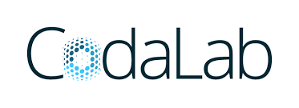

We organize Health Data Challenge (HADACA) dedicated to big data integration in Health.

Up to now, our topic of interest is the quantification of **tumor heterogeneity**.

Main collaborators:

- Yuna Blum (La ligue contre le cancer, programme CIT) : researcher in bioinformatics
- Jerome Cros (AP-HP, Hopital Beaujon) : cancer pathologist
- Sergio Escalera (University of Barcelona) : coordinator of the codalab digital platform project
- Isabelle Guyon (INRIA) : coordinator of the codalab digital platform project
- Magali Richard (CNRS) : researcher in bioinformatics

Digital plateform hosting the challenges : CODALAB

## Health Data Challenge 

[HADACA challenge 2nd edition (2019)](data_challenges_2019.html)

[HADACA challenge 1sr edition (2018)](data_challenges_2018.html)

