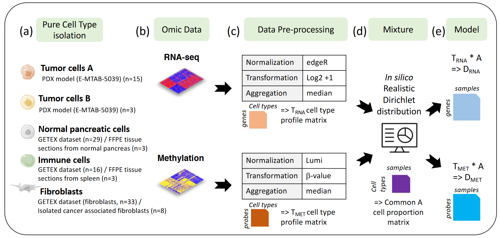
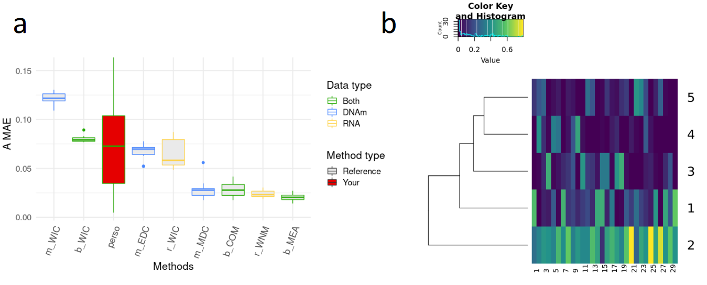

 

##Deconbench plateform

Deconbench will be available on Codalab [here]( https://competitions.codalab.org/competitions/23660). 

  

##R environment

DECONbench is designed to execute methods developed in R environment, using a docker image provided [here](https://hub.docker.com/r/a2alexis/codalab2019). 

A list of R packages installed on the docker image is provided [here]( https://gricad-gitlab.univ-grenoble-alpes.fr/codalab/docker-recipes/tree/master/Hadaca_2019) (more can be installed upon request).

 

##Supplementary information

 

###Reference methods

The 8 reference methods are detailed on 
[this page](benchmarking_reference_methods.html).

 

###Benchmark dataset construction

(a) 5 different cell populations present in pancreatic tumors were considered. 
(b) Raw transcriptome and methylome profiles of these different cell populations were extracted from various sources (PDX model, tissues or isolated cells). 
(c) Raw cell type profile matrices were preprocessed (Feature filtering, normalization, signal transformation, sample aggregation) to avoid any batch effect. 
(d) In silico Dirichlet distribution have been used based on realistic proportions defined by the anatomopathologist expertise (J. Cros). 
(e) Paired methylome and transcriptome of in silico mixtures from pancreatic tumors were obtained by considering D = T A, with T the cell-type profiles (matrix of size M \* K, with M the number of features and K=5 the number of cell types) and A the cell-type proportion per patient (matrix of size K \* N, with N=30 the number of samples) common between both omics.  

 

###DECONBench graphical outputs

(a) Boxplots of the Mean Absolute Errors (MAE) of the estimations of the A matrices (i.e. proportion matrices) obtained for each method that uses the transcriptome only (yellow), the methylome only (blue) or both omics (green). Boxplots of the reference methods and other existing methods are shown in grey, whereas the user's method is shown in red. 
(b) Heatmaps of each A-matrix estimate are generated. The cell populations are in rows and the samples in columns.

