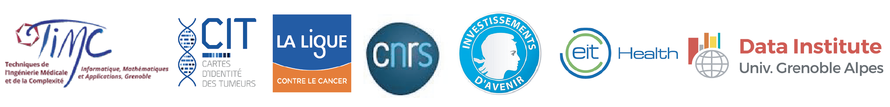

## HADACA project

[Challenge information (2nd edition)](data_challenges.html)

Data challenges about computional methods to quantify cancer heterogeneity.
[HADACA Consortium](data_challenges_HADACAconsortium.html)

## COMETH project

[Follow our benchmarking project](deconbench.html)

Benchmarking platform of computional methods to quantify cancer heterogeneity

## Misc about cancer heterogeneity

Want to know more about cancer heterogeneity, data challenge organisation and benchmarking of computation methods for biology? 

[Have a look at our scientific publication and blog posts](blog.html)

