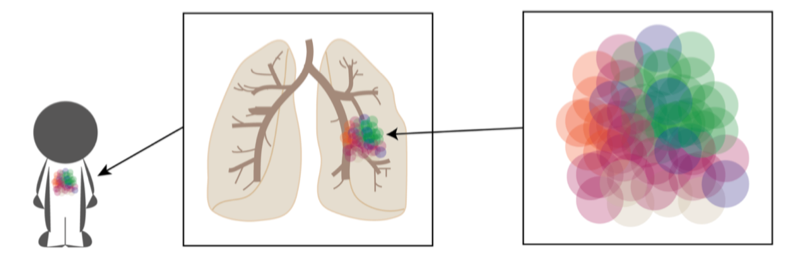
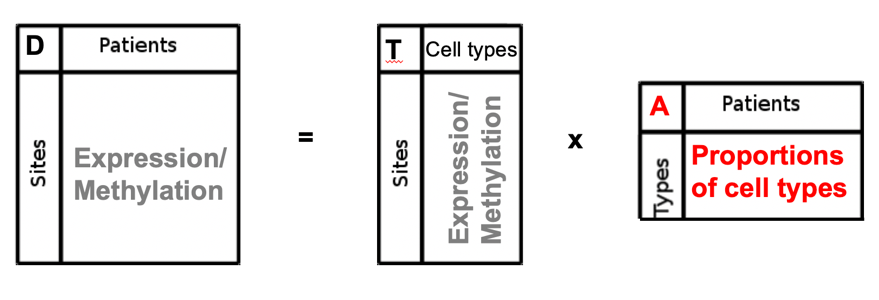
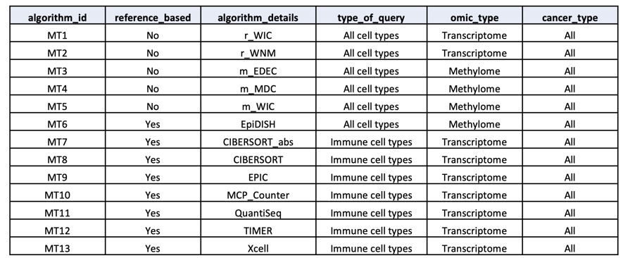
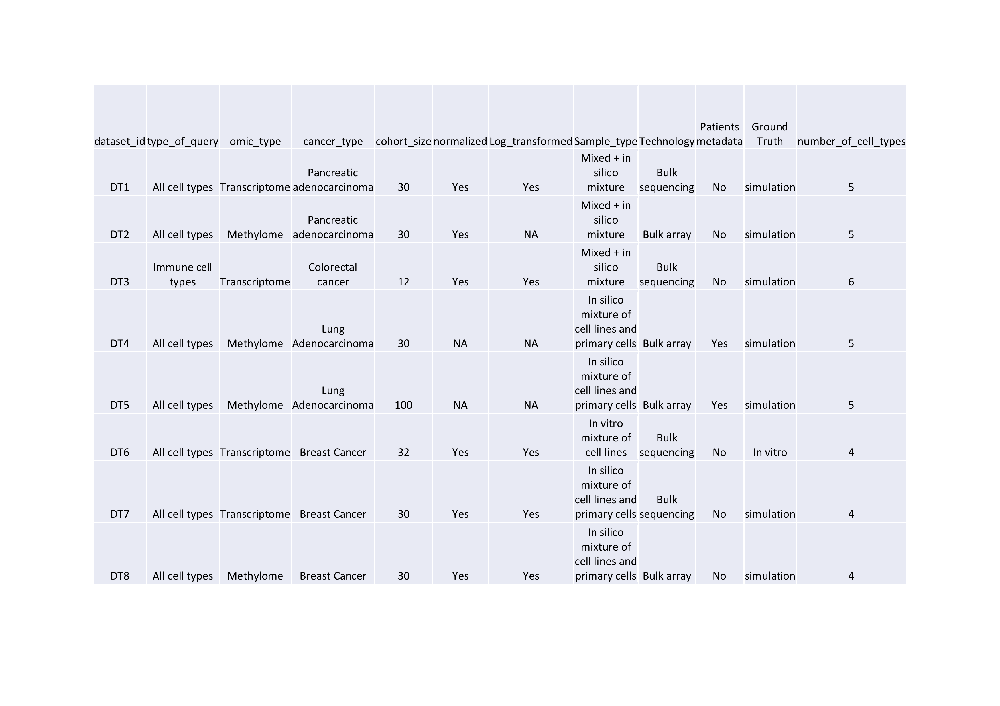

# Overview: Scientific and clinical context

Each tumor composition is different from a patient to another: different type of cell populations might be present in various proportions 

.

Each tumor is a mix of different cell populations in various proportions.
Advanced microdissection techniques to isolate a population of interest from heterogeneous clinical tissue samples are not feasible in daily practice. An alternative is to rely on computational deconvolution methods that infer cell-type composition from mixed (=”bulk”) samples.

This variable composition might be associated to difference in treatment response as well as distinct prognosis as shown by our team and others (Blum et al 2019, Nature Communication). It is therefore a high priority to describe as best as possible this “intra tumor” heterogeneity to better predict the more appropriate clinical care for each patient and go even further in personalized medicine.

**The goal of the cometh web application** is to quantify tumor heterogeneity within clinical cancer omic samples (how many cell types are present? In which proportion?).

# Computational methods

Computational methods identify an **estimate of the cell type proportion matrix**, given the predicted number of **K** cell types. 

This computational method consists in solving a “convolution” equation to estimate the matrix $A$ (here of cell type proportions) of size $KxN$, with $K$ the putative number of cell populations and N the number of samples :

. 
 
where $D$ (size $MxN$) represents the molecular data of bulk mixed samples, with $M$ the number of molecular features (genes for example) and $T$ (size $MxK$) the molecular profiles of the cell types. 

In our context, a deconvolution method will enable to deconvolve a molecular measurement of a tumor sample into its different cellular components and to quantify their proportions.

## The different types of deconvolution methods

Two types of deconvolution approaches have been proposed in the literature: either "reference-based" using profiles of known cell types and numbers of populations, or " reference-free" using, for example, non-negative matrix factorization (NMF) or independent component analysis (ICA). In addition, different types of molecular data can be extracted from biological material and used as a surrogate for in silico deconvolution. Most existing methods use either DNA methylation or gene expression data as a molecular indicator. The combination of different omics types to assess tumor heterogeneity has been poorly studied until now, which will be made possible by our innovative benchmarking platform.

## Criteria used for the selection

We first based our selection on the outcome of our [HADACA data challenge](https://tinyurl.com/hadaca2019),  gathering a consortium of more than thirty international [experts](https://cancer-heterogeneity.github.io/data_challenges_HADACAconsortium.html) in the field.
We selected the five best methods among all the ones collectively discovered and implemented during the challenge, that predictde the real cell proportions with the highest accuracy (i.e. lowest Mean Absolute Error between the estimate and the ground truth).

 These methods consist in different strategies : 
 
- Omics type : transcriptome or methylome
- Feature selections: variance based or ICA based
- Deconvolution algorithms: Edec, Medecom, snmf, ICA

In addition, we conducted an extensive review of the literature to select reference deconvolution methods based on the following criteria :

-	Associated publication: method published in a high-impact journal and highly cited (relative to the year of publication)
-	Year of publication: the most recent methods have been prioritized
-	Implementation: preference for the R language (R software is free and open access)

## Selection of 13 reference methods

We ended up with 13 reference methods including both reference-free and reference-based methods and dealing with transcriptome or methylome data. 

. 

# Evaluation of methods performances

## Reference datasets

Computational methods are evaluated on a set of reference benchmark datasets. We generated 8 benchmarks datasets enabling a comprehensive evaluation of the methods.

. 

We assume a reference dataset is composed of :

- a data_test **D**  matrix composed of omic value for $N$ samples, for $M$ given features (genes, methylation probes...). 
- a data_solution **A**  matrix composed of proportion value for $N$ samples, for $K$ cell types given features (genes, methylation probes...). 

For instance:

```{r echo=FALSE}
test_data_met = readRDS("data/test_data_met.rds")
test_data_rna =  readRDS("data/test_data_rna.rds")
```

```{r results="verbatim", echo=TRUE}
dim(test_data_met)
dim(test_data_rna)
head(test_data_met)
head(test_data_rna)
```

```{r echo=FALSE}
test_solution = readRDS("data/test_solution.rds")
```

```{r results="verbatim", echo=TRUE}
dim(test_solution)
head(test_solution)
```

## Scoring metrics

The discriminating metrics are computed on the A matrix. The rank of each method correspond to the mean rank of each method based on several metric evaluating the accuracy of the methods :

- **mean absolute error** between the estimate and the groundtruth.
- **root mean square error** between the estimate and the groundtruth.
- **kendall correlation** between the estimate and the groundtruth.
- **spearman correlation** between the estimate and the groundtruth.

## Benchmark leaderboard

All evaluation of the methods are accessible through the benchmark leaderboard located on the codabench benchmark platform.

# Clinician datasets

At this point, we assume you have a dataset on which you would like to perform tumor heterogeneity quantification. Before uploading to COMETH web app, you should first check your dataset format using the following guidelines.


## Dataset format

Your dataset (corresponding to matrix $D$ in our model) should be in .csv format, with ';' as separators.

```{r echo=TRUE}
DT_file_name = "data/dataset_clinician.csv"
DT_clinician = read.table(DT_file_name, sep =";", header=TRUE, row.names = 1)

```

You can test that your dataset is at the correct format by using the following R script

```{r echo=TRUE}
print(sprintf("Your transcriptome data has %d samples (columns) of %d genes/probes (rows)",
              ncol(DT_clinician),nrow(DT_clinician)))
head(DT_clinician[,1:min(4,ncol(DT_clinician))])
```


## Data normalisation

Your dataset should be normalized.

Your data might need normalization, for example if you observed a lot of variance between the samples. 

You can check your data with the following code :
```{r echo=TRUE}
library(ggplot2) 
cs=colSums(DT_clinician)
F=(ecdf(cs))
ggplot(data.frame(x=F(cs),y=cs), 
       aes(x=x,y=y)) +   
geom_point() +
stat_smooth(formula = y ~ x,
              method = lm, 
              level=0.9973)
```

### Gene expression data
For gene expression data, we suggest the following normalization strategy:

- micro-array : rma function from "affy"package in R
- RNA-seq : DESeq, EdegR, transcripts per million (TPM)...

In case ofconfounding factor such as batch effect, we refer you to
estimateSizeFactors and sizeFactors functions of the "DESEq2" package

### Methylation data

For methylation array, we suggest the following normalization strategy:

- lumiMethyN function from Illumina "lumi"package in R


## Data transformation

Your dataset can be at linear scale of transformed. 

Please check the transformation (if any) that was applied to your data.

### Gene expression data

Pseudo log transformation (log2+1) is a transformation often applied to expression data. 

It also enable to check for Poisson Noise in your data, an excess of variance in the low value range : 
.


You can test the transformation of your data using the following R script :


```{r echo=FALSE}
# Simulating raw count data
DT_raw=round(2^(DT_clinician) -1) 
```
```{r echo=TRUE}
#plotting 2 first samples in native space
plot(DT_raw[,1], DT_raw[,2], cex=.1)

# log transform 
logcounts <- logcounts <- log2( DT_raw + 1 )
#plotting 2 first samples in log space
plot(logcounts[,1], logcounts[,2], cex=.1)


```

Working in Log space can improve your analysis.   

You can check with the following code : 

```{r echo=TRUE}
pc <- prcomp( t(DT_raw)  ) 

#plotting 2 first components in native space
#plot(pc$x[,1], pc$x[,2])
s=summary(pc);
#importance of 2 first components in native sapce
s$importance[,1:2]

pc <- prcomp( t( logcounts ) )
#plotting 2 first components in log space
#plot(pc$x[,1], pc$x[,2])

s=summary(pc);
#importance of 2 first components in log space
s$importance[,1:2]

```

### Methylation data

Methylation data are usually beta-values or m-values. 

M-values can be obtains with beta2m function from Illumina "lumi" package in R.

you can use beta2m and m2beta functions of Illumina "lumi" package

You can test the transformation of your data using the following R script
```{r echo=FALSE}
# Simulating m-values
DT_m=apply(DT_clinician,2,scale)*2
```
```{r echo=TRUE}

#plotting 2 first samples of m-values
plot(DT_m[,1], DT_m[,2], cex=.1)

# m-values to beta-values
betavals <- 2^DT_m/(2^DT_m + 1)

#plotting 2 first samples of beta-values
plot(betavals[,1], betavals[,2], cex=.1)


```

# Clinician dataset metadata

Along with your omic dataset, we ask you to specify the cancer type related to your data (to be chosen within the [TCGA references](https://gdc.cancer.gov/resources-tcga-users/tcga-code-tables/tcga-study-abbreviations)) and to estimate the number of cell types $K$ of your data. 

Please be prepared to fill this information on the COMETH web application.

